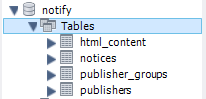
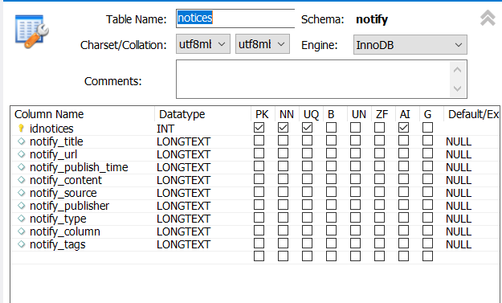
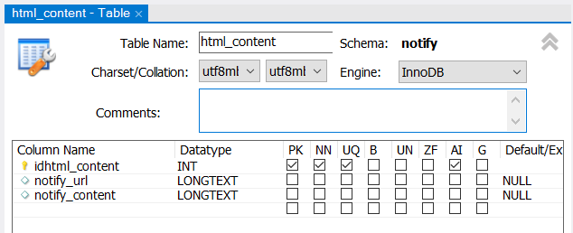
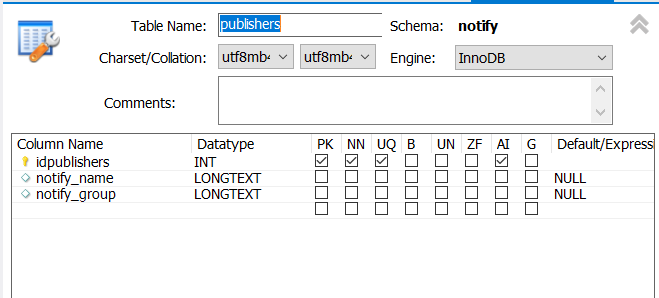
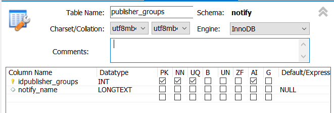
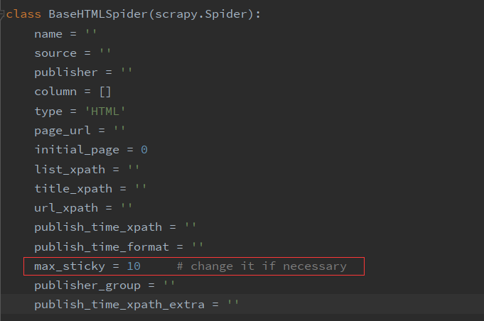

## There is a tested sql example file you can use to build these tables.

notify_scrapy/notify_2021.sql

# How to use this scrapy

0. check that you have installed all module needed.

1. You need to make sure the MySQL service is running in your machine. 

2. You shall build your MySQL like the pictures below:

   

   

   

   

   

3. change the MYSQL_USER and MYSQL_USER_PASSWORD in **settings.py** if necessary. And you shall also change the function **def open_spider(self, spider)** in **db_pipline.py**

   ```python
   def open_spider(self, spider):
           # the user is 'root' and the password is 'Notify', change it if necessary
           self.db = MySQLdb.connect(self.mysql_uri, "root", "Notify", self.mysql_db, charset='utf8')
   ```

4. You can change the max_sticky in **base_html_spider.py** ,For details, see https://git.zjuqsc.com/notify/notify-scrapy/wikis/Sticky-Notices


 

4. Launch the **Launcher.py** by py Launcher.py in this directory, and type in the location of the folder *notify_scrapy*. And Then all the spider will work by order.

