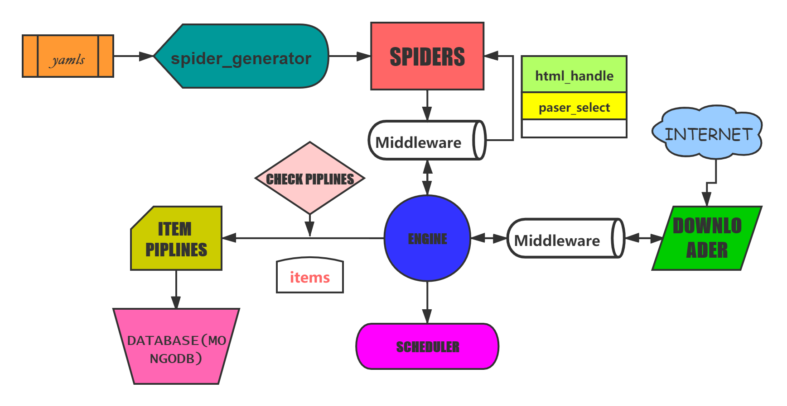
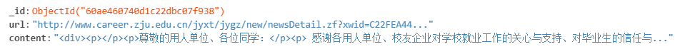
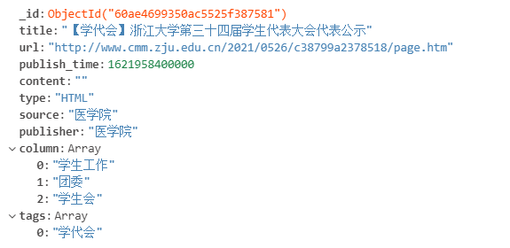
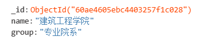

# 爬虫文档

------

**这个文档用于交付微信小程序比赛，本scrapy使用文档为同一文件夹下的 How to use this scrapy.md ，请务必阅读！**

------

**Notify小程序的爬虫主要使用了Scrapy架构**

选择使用Scrapy架构可以较好地满足Notify小程序对于多个大型网站的多条通知的实时爬取，保证爬取的有效性和速率，方便针对学校院网的频繁更新而同步更新我们的爬虫设置。



**在robots协议的遵守上**，经过仔细的调研，我们发现我们爬取范围的学校网站并没有设置robots协议，因此在保证爬取的安全性和规范性的前提下，我们选择在爬取学校院网时忽略robots协议来提高爬虫的运行效率。

**在爬取通知的条件选择上**，一条通知是否需要被我们爬取下来，取决于其是否具有时效性和重要性。

- **时效性：**我们在Scrapy框架中添加了通知的时间限制，目前将其设置成2020年9月1日，即位于2020年9月1日之前的通知都不会被我们爬取。我们可以通过对于爬取最早时间的更改来增减数据库中的总数据量，避免了数据库的臃肿。

- **重要性：**我们对所有的学校网站进行了调研，并针对每一个网站所需爬取的通知的栏目进行了个性化选择，以尽可能确保每一条爬取的通知都能面向我们的目标群体，都能较为有效地提供信息。

  结合实际情况，我们发现，在一些学校的院网之中采用了消息置顶，这可能会导致网页头部的通知的发布时间越过了我们设置的时间限制。针对这个情况，我们针对每一个爬虫个性化设置了max_sticky，即无视时间限制的最少爬取量，这样就可以使得每一个网页都可以正确得被爬取。

**我们将爬取下来的数据分成四个数据表**：html_content,notices,publiser_groups,publishers。

- **html_content:**

  这个数据表中我们储存了每一条被成功解析的通知的url和content，示例情况如下

  

  创建命令：
  ```
  CREATE TABLE `html_content` (
  `_id` int(11) NOT NULL AUTO_INCREMENT,
  `url` longtext CHARACTER SET utf8mb4,
  `content` longtext CHARACTER SET utf8mb4,
  PRIMARY KEY (`_id`)
  ) ENGINE=InnoDB DEFAULT CHARSET=utf8mb4 
  ```
  
- **notices:**

  这个数据表中我们储存了所有爬到的通知的基本信息，包括：

  title：通知的题目

  url：通知的url

  publish_time：通知时间的时间戳

  type：通知的类型

  publisher：消息发布者

  source：消息来源

  column：消息的栏目

  tags：消息的标签(如果有)

  示例情况如下：

  

  创建命令：
  ```
  CREATE TABLE `notices` (
  `_id` int(11) NOT NULL AUTO_INCREMENT,
  `title` longtext CHARACTER SET utf8mb4,
  `url` longtext CHARACTER SET utf8mb4,
  `publish_time` longtext CHARACTER SET utf8mb4,
  `content` longtext CHARACTER SET utf8mb4,
  `type` longtext CHARACTER SET utf8mb4,
  `source` longtext CHARACTER SET utf8mb4,
  `publisher` longtext CHARACTER SET utf8mb4,
  `column` longtext CHARACTER SET utf8mb4,
  `tags` longtext CHARACTER SET utf8mb4,
  PRIMARY KEY (`_id`)
  ) ENGINE=InnoDB DEFAULT CHARSET=utf8mb4 
  ```

  **注意：** 务必将字符串编码指定为 utf8mb4，否则会出现爬虫无法输入，锁数据库等后果。

- **publisher_groups：**

  这个数据表中我们储存了所有的消息发布者所属组，示例情况如下：

  

  创建命令：
  ```
  CREATE TABLE `publisher_groups` (
  `_id` int(11) NOT NULL AUTO_INCREMENT,
  `name` longtext CHARACTER SET utf8mb4,
  PRIMARY KEY (`_id`)
  ) ENGINE=InnoDB DEFAULT CHARSET=utf8mb4 
  ```

- **publishers：**

  这个数据表中我们储存了所有的消息发布者以及其所属组，示例情况如下:

  

  创建命令：
  ```
  CREATE TABLE `publishers` (
  `_id` int(11) NOT NULL AUTO_INCREMENT,
  `name` longtext CHARACTER SET utf8mb4,
  `group` longtext CHARACTER SET utf8mb4,
  PRIMARY KEY (`_id`)
  ) ENGINE=InnoDB DEFAULT CHARSET=utf8mb4 
  ```

**在爬取内容的分析和处理上：**考虑到学校网站之间的通知转发和学校网站对非学校网站的通知文章的转发，我们采取了针对单个学校网站的分析模式，对每一个学校网站的编写风格提供了一套专属的解析模式，借此来呈现同一网站通知的直接内容或是直接记载不同网站转发的Url来达到最好的展现效果。

于此同时我们对解析成功的html内容也进行了二次加工，主要体现在加强了其简洁性，具体工作在html_content_piplines里面完成，其中的简化工作有：

- 删除任何\<meta>标记
- 删除所有嵌入的对象（flash、iframes）
- 删除任何\<link>标记
- 删除所有样式标记
- 删除任何处理指令
- 删除所有样式属性。默认为样式选项的值
- 删除任何Javascript，比如onclick属性。同时删除stylesheets，因为它们可能包含Javascript
- 删除任何注释
- 删除所有与框架相关的标记
- 删除任何窗体标记

这些标签都是正确的，但是他们的存在会极大影响我们爬取内容的简洁性，如\<blink> and \<marquee>，这违背了Notify的初衷。

**在爬虫的编写和维护上：**考虑到校园网站的高度重复性以及快速更新的特点，我们采用了自动的spider_generator来快速编写爬虫并方便我们日后对于爬虫的维护。通过书写规定格式的yaml文件，我们可以通过spider_generator快速地生产标准的爬虫文件。具体的yaml文件格式如下：(以航空航天学院为例)

```yaml
version: '3.3'

name: aeronautics_school
source: 航空航天学院
publisher: 航空航天学院
initial_page: 0
list_xpath: "//ul[@class=\"cg-news-list\"]/li"
title_xpath: ".//a/@title"
url_xpath: ".//a/@href"
publish_time_xpath: ".//span/text()"
publish_time_format: "%Y-%m-%d"
pages_converter: and_page_equals
publisher_group: 专业院系
pages:
# Omitted
```

在日后的更新维护中，我们也可以通过spider_generator来达到快速更新爬虫的目的。spider_generator的编写大大降低了我们的工作量，使得爬虫的编写和维护更加的高效，也更加的标准。

**在爬虫的启动上：** 我们设置了两种模式，第一种是在scrapy命令中增添了自定义命令crawl_module *(usage: scrapy crawl_module <spider_name_prefix>)*来方便进行调试，其功能为根据输入的爬虫前缀，搜索并启动爬虫库中的所有拥有该前缀的爬虫。第二种是通过Python脚本实现的爬虫全启动。考虑到我们的爬虫数量较为庞大，一次性的全部启动容易对服务器的性能和网站造成恶劣影响，我们采取了分步启动的方式，即通过自定义crawl_module命令来多次适量地启动爬虫，达到兼顾效率和安全的目的。

